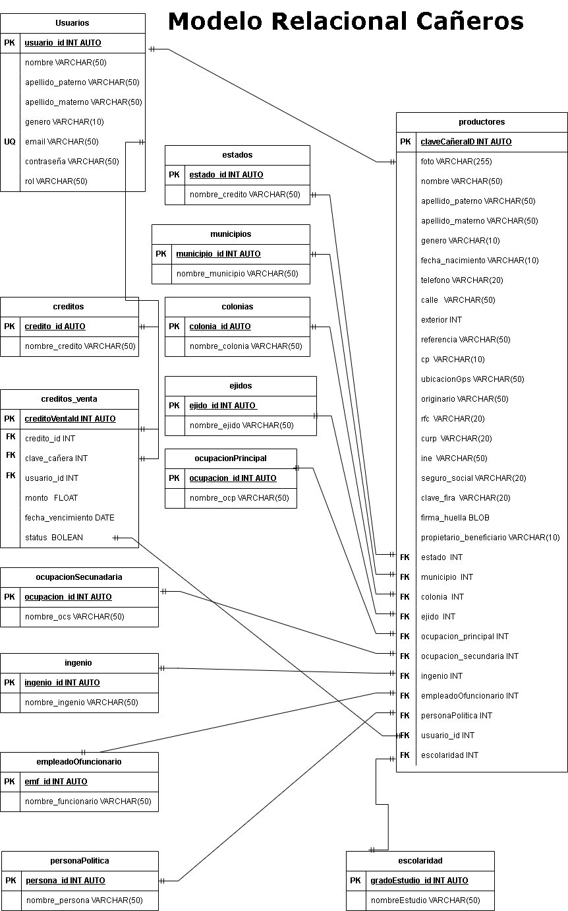

# Cañeros

# Glosario

## LISTA DE ENTIDADES

## usuarios **(ED)**

- usuario_id **(PK)**
- nombre
- apellido_paterno
- apellido_materno
- genero
- email **(UQ)**
- contraseña
- rol

## productores **(ED)**

- claveCañera_id **(PK)**
- foto
- nombre
- apellido_paterno
- apellido_materno
- genero
- fecha_nacimiento
- telefono
- calle
- exterior
- referencia
- cp
- ubicacionGps
- originario
- rfc
- curp
- ine
- seguro_social
- clave_fira
- firmaHuella
- propietario_beneficiario
- estado    **(FK)**
- municipio **(FK)**
- colonia   **(FK)**
- ejido     **(FK)**
- ocupacionPrincipal **(FK)**
- ocupacionSecundaria **(FK)**
- escolaridad  **(FK)**
- ingenio    **(FK)**
- empleadoOfuncionario **(FK)**
- personaPolitica **(FK)**
- usuario_id **(FK)**

## creditos **(ED|EC)**

- credito_id  **(PK)**
- nombre_credito

## creditos_venta **(EP)**

- credito_venta_id **(PK)**
- credito_id **(FK)**
- claveCañera_id **(FK)**
- usuario_id **(FK)**
- monto
- fecha_vencimiento
- status

## estados   **(EC)**

- estado_id **(PK)**
- nombre_estado

## municipios   **(EC)**

- municipio_id **(PK)**
- nombre_municipio
  
## colonias   **(EC)**

- colonia_id **(PK)**
- nombre_colonia

## ejido  **(EC)**

- ejido_id **(PK)**
- nombre_ejido

## ocupacionPrincipal   **(EC)**
  
- ocupacion_id  **(PK)**
- nombre_ocupacionP

## ocupacionSecundaria   **(EC)**
  
- ocupacion_id  **(PK)**
- nombre_ocupacionS

## EstadoCivil   **(EC)**
  
- esc_id  **(PK)**
- tipo_estadoCivil

## Escolaridad   **(EC)**
  
- gradoEstudio_id  **(PK)**
- nombre_escolaridad

## Ingenio  **(EC)**
  
- ingenio_id  **(PK)**
- nombre_ingenio

## Empleado_funcionario  **(EC)**
  
- ef_id  **(PK)**
- nombre_funcionario

## personaPolitica **(EC)**
  
- persona_id  **(PK)**
- nombre_persona

## Relaciones

1. - un **usuario** tiene **productores** (_1 - M_).
1. - un **productor** tiene **estado** (_1 - 1_).
1. - un **productor** tiene **municipio** (_1 - 1_).
1. - un **productor** tiene **colonia** (_1 - 1_).
1. - un **productor** tiene **ejido** (_1 - 1_).
1. - un **productor** tiene **ocupacionPrincipal**(_1 - 1_).
1. - un **productor** tiene **ocupacionSecudaria** (_1 - 1_).
1. - un **productor** tiene **estadoCivil** (_1 - 1_).
1. - un **productor** tiene **escolaridad** (_1 - 1_).
1. - un **productor** tiene **ingenio** (_1 - 1_).
1. - un **productor** es **empleadoOfuncionario** (_1 - 1_).
1. - un **productor** es **personaPolitica** (_1 - 1_).
1. - un **productor** tiene **credito** (_1 - 1_).
1. - un **venta** pertenece a un **credito** (_1 - 1_).

# Diagramas
 
 ### Modelo Relacional de la BD

# Reglas del negocio

### usuarios

1. Crear el registro de un usuario
2. Leer el registro de un usuario dada una condición en particular.
3. Leer todos los registros de la entidad usuarios.
4. Actualizar los datos de un usauri dada una condición en particular.
5. Eliminar los datos de un usuario dada una condición en particular.

### productores

1. Crear el registro de un productor
2. Leer el registro de un(os) productores dada una condición en particular.
3. Leer todos los registros de la entidad tipos productores.
4. Actualizar los datos de productores dada una condición en particular.
5. Eliminar los datos de productores  dada una condición en particular.

### estados

1. Crear el registro de un estado
2. Leer el registro de un(os) estados dada una condición en particular.
3. Leer todos los registros de la entidad estados.
4. Actualizar los datos de un estado dada una condición en particular.
5. Eliminar los datos de un estado dada una condición en particular.

### municipio

1. Crear el registro de un municipio
2. Leer el registro de un(os) municipio dada una condición en particular.
3. Leer todos los registros de la entidad municipio.
4. Actualizar los datos de un municipio dada una condición en particular.
5. Eliminar los datos de un municipio dada una condición en particular.

### colonias

1. Crear el registro de una colonia
2. Leer el registro de un(os) colonia dada una condición en particular.
3. Leer todos los registros de la entidad colonia.
4. Actualizar los datos de un colonia dada una condición en particular.
5. Eliminar los datos de una colonia dada una condición en particular.

### ejidos

1. Crear el registro de un ejido
2. Leer el registro de un(os) ejido dada una condición en particular.
3. Leer todos los registros de la entidad ejidos.
4. Actualizar los datos de un ejido dada una condición en particular.
5. Eliminar los datos de un ejido dada una condición en particular.

### ocupacion principal

1. Crear el registro de una ocupacion principal
2. Leer el registro de un(os) ocupacion principal dada una condición en particular.
3. Leer todos los registros de la entidad ocupacion principal.
4. Actualizar los datos de una ocupacion principal dada una condición en particular.
5. Eliminar los datos de una ocupacion principal dada una condición en particular.

### ocupacion secundaria

1. Crear el registro de una ocupacion secundaria
2. Leer el registro de un(os) ocupacion secundaria dada una condición en particular.
3. Leer todos los registros de la entidad ocupacion secundaria.
4. Actualizar los datos de una ocupacion secundaria dada una condición en particular.
5. Eliminar los datos de una ocupacion secundaria dada una condición en particular.

### ingenio

1. Crear el registro de un ingenio
2. Leer el registro de un(os) ingenio dada una condición en particular.
3. Leer todos los registros de la entidad ingenio.
4. Actualizar los datos de un ingenio dada una condición en particular.
5. Eliminar los datos de un ingenio dada una condición en particular.

### empleadoOfuncionario

1. Crear el registro de un empleadoOfuncionario
2. Leer el registro de un(os) empleadoOfuncionario dada una condición en particular.
3. Leer todos los registros de la entidad empleadoOfuncionarios.
4. Actualizar los datos de un empleadoOfuncionario dada una condición en particular.
5. Eliminar los datos de un empleadoOfuncionario dada una condición en particular.

### personaPolitica

1. Crear el registro de un persona politicamente
2. Leer el registro de un(os) persona politicamente dada una condición en particular.
3. Leer todos los registros de la entidad persona politicamentes.
4. Actualizar los datos de un persona politicamente dada una condición en particular.
5. Eliminar los datos de un persona politicamente dada una condición en particular.

### escolaridad

1. Crear el registro de una escolaridad
2. Leer el registro de un(os) escolaridad dada una condición en particular.
3. Leer todos los registros de la entidad escolaridad.
4. Actualizar los datos de un escolaridad dada una condición en particular.
5. Eliminar los datos de un escolaridad dada una condición en particular.